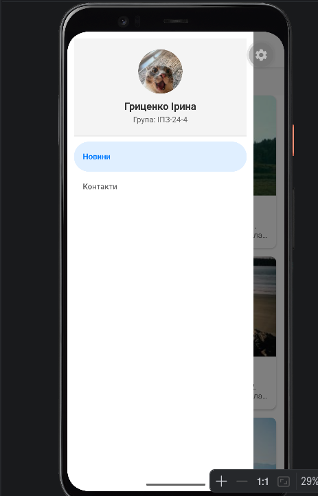
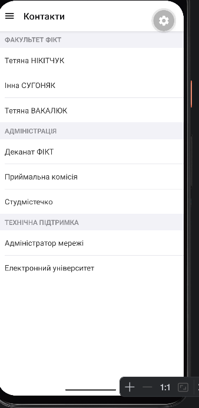
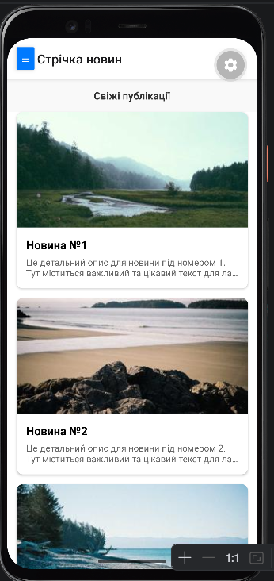

# Інструкція з запуску

### Попередні вимоги
* Node.js (LTS)
* Запущений Android-емулятор в Android Studio

### Запуск проєкту

1. Перейдіть у папку проєкту:
   cd lab2

Встановіть залежності та тунель:

npm install
npm install @expo/ngrok --save-dev

Запустіть сервер розробки:

npx expo start --tunnel

Після завантаження Metro Bundler натисніть клавішу a в терміналі для автоматичного відкриття застосунку на емуляторі.

### Контрольні запитання

Чим відрізняється FlatList від ScrollView?
ScrollView рендерить (завантажує в оперативну пам'ять) усі свої елементи одночасно, незалежно від того, бачить їх користувач на екрані чи ні. Він чудово підходить для невеликих статичних макетів (наприклад, форм реєстрації чи сторінок налаштувань).
FlatList відображає лише ті елементи, які безпосередньо видно на екрані в цей момент. Він динамічно створює та знищує (або перевикористовує) елементи під час прокручування, що робить його незамінним для великих або безкінечних списків.

Що таке віртуалізація списків?
Віртуалізація списків — це механізм оптимізації продуктивності, який обмежує кількість одночасно відрендерених елементів у пам'яті мобільного пристрою.
Замість створення тисяч об'єктів у DOM/Native-ієрархії, інтерфейс створює лише невеличке «вікно» з видимих елементів плюс кілька штук зверху та знизу для плавності скролу. Коли елемент зникає з поля зору, його ресурси звільняються або перевикористовуються для нового елемента, який щойно з'явився. Це дозволяє уникати переповнення оперативної пам'яті (RAM) та усуває зависання інтерфейсу.

Як здійснюється передача параметрів між екранами?
У бібліотеці React Navigation передача параметрів відбувається у два кроки:
* Під час відправки (навігації): Параметри передаються у вигляді об'єкта як другий аргумент функції navigation.navigate().  
Приклад:navigation.navigate('Details', { id: item.id, title: item.title }).
* Під час отримання (на цільовому екрані): Дані витягуються за допомогою пропса route, який автоматично доступний у компонентах екранів, через об'єкт route.params.  
Приклад: const { title } = route.params;.

Що таке вкладена навігація?
Вкладена навігація (Nested Navigation) — це архітектурний підхід, при якому один навігатор рендериться всередині екрану іншого навігатора.
Це дозволяє створювати складні структури інтерфейсів. Наприклад, у лабораторній роботі головним навігатором є Drawer Navigator (бокове меню). Одним із його екранів є вкладений Stack Navigator, який керує переходами між двома екранами — стрічкою новин (MainScreen) та деталями конкретної публікації (DetailsScreen).

У яких випадках застосовується SectionList?
SectionList застосовується тоді, коли дані в списку мають чітку логічну структуру, розділену на групи або категорії (секції), і для кожної групи необхідно відображати окремий заголовок.
Типові випадки використання:
* Список контактів, згрупований за першою літерою імені або за відділами (як-от контакти університетських кафедр та адміністрації).
* Розклад занять чи подій, згрупований за днями тижня.
* Меню в ресторані чи категорії товарів в інтернет-магазині.

Скріншоти виконання

