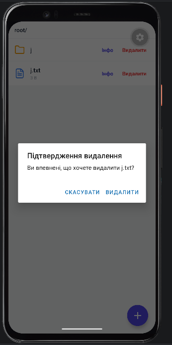
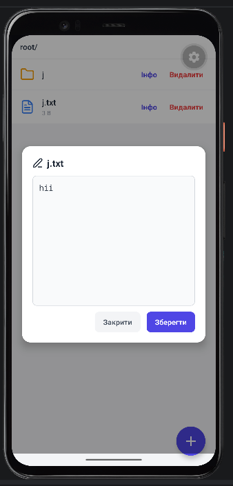
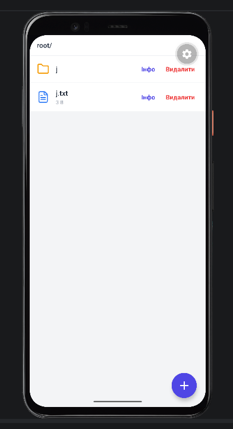
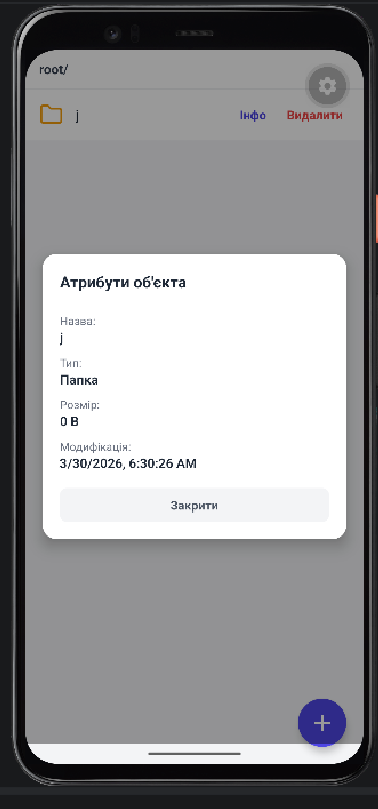
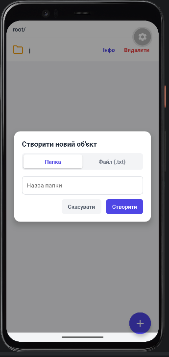
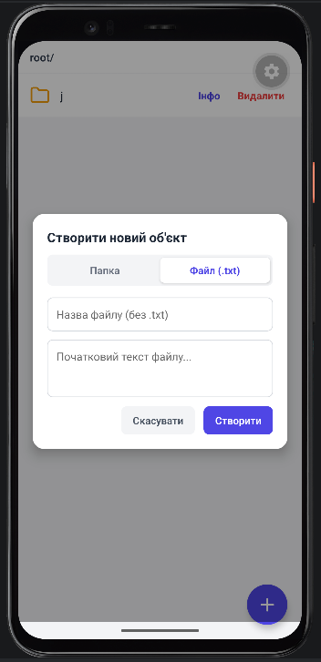

# Інструкція з запуску

### Попередні вимоги
* Node.js (LTS)
* Запущений Android-емулятор в Android Studio

### Запуск проєкту

1. Перейдіть у папку проєкту:
   cd lab4

Встановіть залежності та тунель:

npm install
npm install @expo/ngrok --save-dev

Запустіть сервер розробки:

npx expo start --tunnel

Після завантаження Metro Bundler натисніть клавішу a в терміналі для автоматичного відкриття застосунку на емуляторі.

Скріншоти виконання

