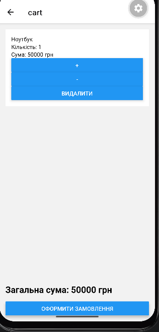
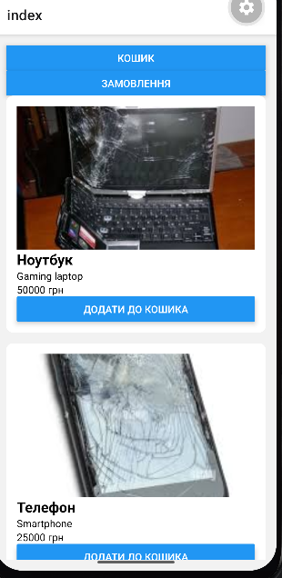

# Інструкція з запуску

### Попередні вимоги
* Node.js (LTS)
* Запущений Android-емулятор в Android Studio

### Запуск проєкту

1. Перейдіть у папку проєкту:
   cd lab7

Встановіть залежності та тунель:

npm install
npm install @expo/ngrok --save-dev

Запустіть сервер розробки:

npx expo start --tunnel

Після завантаження Metro Bundler натисніть клавішу a в терміналі для автоматичного відкриття застосунку на емуляторі.

Скріншоти виконання

3. Контрольні запитання

1. Що таке глобальний стан у React Native?
   Це спосіб зберігання даних, які мають бути доступні багатьом компонентам програми незалежно від їхнього рівня вкладеності. Глобальний стан дозволяє
   уникнути прокидання даних через проміжні компоненти, забезпечуючи централізований доступ до даних (наприклад, стан користувача, список
   товарів, налаштування теми).

2. Для чого використовується Redux Toolkit?
   Це офіційний рекомендований інструментарій для Redux. Він спрощує написання логіки Redux, зменшуючи кількість шаблонного коду, надає
   вбудовані засоби для обробки асинхронних дій та налаштування сховища, що робить розробку швидшою та безпечнішою.

3. Яке призначення createSlice?
   Функція createSlice дозволяє одночасно визначити стан, редуктори та дії в одному місці. Вона автоматично генерує творці дій 
та типи дій, що значно спрощує управління логікою зміни стану.

4. Для чого використовується configureStore?
   Це функція, яка спрощує створення магазину Redux (Store). Вона автоматично налаштовує стандартні middleware (включаючи redux-thunk), додає підтримку
   інструментів розробника (Redux DevTools) та об'єднує всі редуктори в єдине сховище.

5. Для чого використовується redux-persist?
   Це бібліотека для збереження (персистентності) стану Redux між сесіями. Вона дозволяє автоматично зберігати дані стану в локальне сховище (наприклад,
   AsyncStorage в React Native) і автоматично завантажувати їх при запуску додатка, щоб користувач не втрачав свій прогрес при закритті програми.

Реалізація
* Управління станом (Redux Toolkit):
  * productsSlice: Відповідає за зберігання та керування каталогом товарів.
  * cartSlice: Реалізує логіку кошика покупок (додавання товарів, збільшення/зменшення кількості, видалення позицій, повне очищення кошика).
  * usersSlice: Керує даними користувача.
  * ordersSlice: Обробляє інформацію про оформлені замовлення.
    * Персистентність даних (redux-persist): Використання redux-persist разом з AsyncStorage дозволяє зберігати стан кошика та користувача локально. Завдяки
      цьому обрані товари залишаються в кошику навіть після перезапуску застосунку.
    * Централізований Store: Налаштований через configureStore з об'єднанням усіх редукторів (combineReducers) та відключенням serializableCheck для коректної
      роботи з redux-persist.
    * Middleware: Налаштовано стандартний стек для обробки Redux-дій, що забезпечує стабільну роботу асинхронних операцій у межах застосунку.

